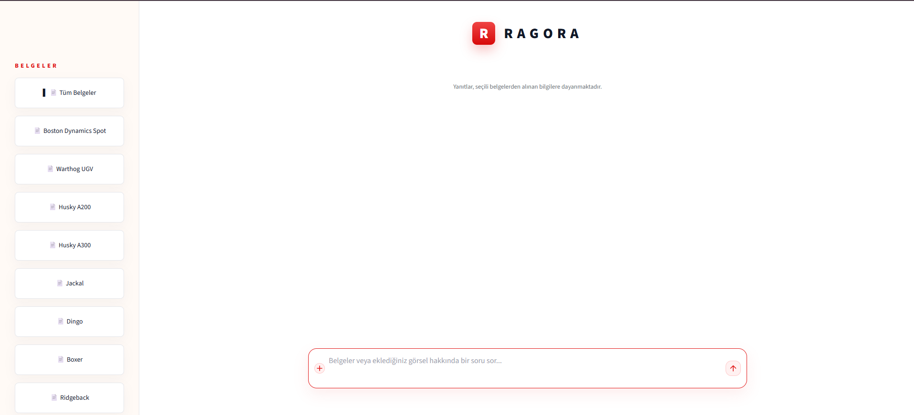

# RAGORA

RAGORA; Clearpath Robotics insansız kara araçları ile Boston Dynamics Spot
dokümanları üzerinde çalışan, metin ve görsel destekli Türkçe bir RAG
(Retrieval-Augmented Generation) uygulamasıdır. Kullanıcı sorularını ilgili
proje kaynağına yönlendirir, MongoDB ve Qdrant üzerinde arama yapar ve bulunan
kanıtlara dayanarak Ollama üzerinden yanıt üretir.

Arayüz [Streamlit](https://streamlit.io/) ile sunulur. Uygulamanın tüm servisleri
Docker Compose ile birlikte çalıştırılabilir.

## Arayüz



Sol panelden tüm belgeler veya belirli bir robot dokümanı seçilebilir. Alt
bölümdeki sohbet alanı metin sorularını ve yüklenen görselleri kabul eder;
üretilen yanıtlar seçilen belgelerden getirilen bilgilere dayanır.

## Özellikler

- Clearpath ve Spot dokümanlarında anlamsal arama
- Türkçe teknik soru-cevap ve kaynak gösterimi
- Robot veya ürün adına göre otomatik sorgu yönlendirme
- Clearpath ve Spot arasında karşılaştırmalı, çok kaynaklı cevaplar
- Yüklenen görseller için CLIP tabanlı benzerlik araması
- Görsel ve metin bağlamını birlikte kullanan Vision RAG akışı
- MongoDB ile doküman/metadata, Qdrant ile vektör saklama
- Qwen metin ve vision modellerinin Ollama üzerinden yerel çalıştırılması
- İndeks bütünlüğü kontrolü ve retrieval değerlendirme araçları

## Mimari

```text
Kullanıcı / Görsel
       |
       v
Streamlit arayüzü
       |
       v
UnifiedRAGRouter
  |         |          |
  |         |          +--> Karşılaştırmalı sorgu
  |         +-------------> Spot RAG
  +-----------------------> Clearpath RAG / Vision RAG
       |                       |
       v                       v
 MongoDB (içerik)        Qdrant (vektörler)
       \                       /
        +------> Ollama <-----+
                 Qwen
```

Ana bileşenler:

- `chatbot/app.py`: Streamlit kullanıcı arayüzü
- `rag/unified_router.py`: Clearpath, Spot ve karşılaştırma yönlendirmesi
- `rag/rag_pipeline.py`: Metin tabanlı Clearpath RAG akışı
- `rag/vision_rag.py`: Görsel arama ve görsel destekli cevap üretimi
- `rag/spot_adapter.py`: Yerel Spot projesiyle entegrasyon
- `database/`: MongoDB ve Qdrant erişim katmanı
- `data_collection/`: Clearpath içerik ve görsel toplama araçları
- `spot-rag-project-son/spot-rag/`: Spot doküman işleme ve retrieval projesi

## Gereksinimler

Önerilen kurulum için:

- Docker Desktop ve Docker Compose
- En az 8 GB RAM; model ve indeksleme işlemleri için daha fazlası önerilir
- Ollama modelleri ve Hugging Face modelleri için yeterli disk alanı

Docker kullanmadan çalıştırmak için Python 3.11 ve çalışan MongoDB, Qdrant ile
Ollama servisleri gerekir.

## Hızlı başlangıç

1. Ortam dosyasını oluşturun:

```powershell
Copy-Item .env.example .env
```

2. Servisleri derleyip başlatın:

```powershell
docker compose up -d --build
```

Compose aşağıdaki servisleri başlatır:

- `mongo`: dokümanlar ve metadata
- `qdrant`: metin ve görsel vektörleri
- `ollama`: yerel LLM servisi
- `ollama-model-init`: gerekli Qwen modellerini indirir
- `chatbot`: Streamlit uygulaması

3. Arayüzü açın:

```text
http://localhost:8501
```

İlk başlatmada modeller indirileceği için hazırlık normalden uzun sürebilir.
Servis durumunu ve günlükleri görmek için:

```powershell
docker compose ps
docker compose logs -f chatbot
```

Servisleri durdurmak için:

```powershell
docker compose down
```

## Verileri indeksleme

### Clearpath verileri

Crawler; Clearpath dokümantasyonunu, metin parçalarını ve uygun görselleri
toplayarak MongoDB ve Qdrant'a kaydeder:

```powershell
docker compose run --rm chatbot python data_collection/crawler.py
```

### Spot PDF'leri

Spot kılavuzlarını metin ve görsel olarak indekslemek için araç profilini
kullanın:

```powershell
docker compose --profile tools run --rm spot-indexer
```

Alternatif seçenekler:

```powershell
# Yalnızca metin indeksleme
docker compose run --rm chatbot python scripts/index_spot_native.py --mode text --reset

# Hibrit indeksi zorla yeniden oluşturma
docker compose run --rm chatbot python scripts/index_spot_native.py --mode hybrid --force

# VLM ile görsel açıklama üretimini de açma
docker compose run --rm chatbot python scripts/index_spot_native.py --mode hybrid --force --with-vlm
```

## Yerel Python kurulumu

Docker yalnızca altyapı servisleri için kullanılacaksa:

```powershell
python -m venv .venv
.\.venv\Scripts\Activate.ps1
python -m pip install --upgrade pip
pip install -r requirements.txt
Copy-Item .env.example .env
docker compose up -d mongo qdrant ollama
streamlit run chatbot/app.py
```

Bu kullanımda `.env` içindeki servis adresleri ana makine portlarını göstermelidir:
MongoDB için varsayılan `27018`, Qdrant için `6333`, Ollama için `11434`.

## Yapılandırma

Temel ayarlar `.env` dosyasından değiştirilir. Önemli değişkenler:

| Değişken | Varsayılan | Açıklama |
|---|---:|---|
| `MONGODB_URI` | `mongodb://localhost:27018/` | Clearpath MongoDB bağlantısı |
| `QDRANT_HOST` | `localhost` | Qdrant sunucusu |
| `QDRANT_PORT` | `6333` | Qdrant HTTP portu |
| `OLLAMA_MODEL` | `qwen2.5:7b` | Metin cevap modeli |
| `OLLAMA_VISION_MODEL` | `qwen2.5vl:7b` | Görsel analiz modeli |
| `EMBED_MODEL` | `intfloat/multilingual-e5-large` | Metin embedding modeli |
| `VISION_RETRIEVAL_MODE` | `hybrid` | `clip`, `hybrid` veya `qwen_caption` |
| `RETRIEVAL_K` | `5` | Getirilecek metin parçası sayısı |
| `SIMILARITY_THRESHOLD` | `0.55` | Retrieval benzerlik alt sınırı |
| `MAX_CONTEXT_CHARS` | `3500` | LLM'e gönderilecek azami bağlam |

Spot koleksiyon adları ve diğer seçenekler için `.env.example` ile
`config/settings.py` dosyalarına bakın. Gizli değer içeren `.env` dosyasını
Git'e eklemeyin.

## Bakım ve doğrulama

MongoDB ile Qdrant referanslarını kontrol edin:

```powershell
docker compose run --rm chatbot python verify_sync.py
```

Veritabanı özetini görüntüleyin:

```powershell
docker compose run --rm chatbot python scripts/inspect_databases.py
```

Retrieval değerlendirmesini çalıştırın:

```powershell
docker compose run --rm chatbot python evaluation/evaluate_retrieval.py --k 5
```

Görsel retrieval akışını inceleyin:

```powershell
docker compose run --rm chatbot python scripts/trace_visual_query.py /app/data/ornek.jpg
```

> [!WARNING]
> `python rebuild_databases.py` mevcut MongoDB ve Qdrant Docker volume'larını
> silerek veritabanlarını baştan kurar. Geri alınamayacak veri kaybına neden
> olabileceği için yalnızca bilinçli olarak kullanın.

Tam yeniden oluşturma gerektiğinde:

```powershell
python rebuild_databases.py
```

## Proje yapısı

```text
Ragora-Web/
|-- chatbot/                 # Streamlit arayüzü ve statik dosyalar
|-- config/                  # Merkezi uygulama ayarları
|-- data/                    # Toplanan Clearpath görselleri
|-- data_collection/         # Web crawler ve görsel işleme
|-- database/                # MongoDB ve Qdrant yöneticileri
|-- evaluation/              # Test seti, ölçümler ve sonuçlar
|-- rag/                     # Metin, vision ve birleşik RAG katmanı
|-- scripts/                 # İndeksleme ve teşhis araçları
|-- spot-rag-project-son/    # Spot alt projesi ve PDF kılavuzları
|-- docker-compose.yml       # Uygulama servisleri
|-- Dockerfile               # Chatbot çalışma imajı
|-- rebuild_databases.py     # Tam veritabanı yeniden kurulum aracı
|-- verify_sync.py           # MongoDB-Qdrant bütünlük kontrolü
`-- requirements.txt         # Python bağımlılıkları
```

## Sorun giderme

- Arayüz açılmıyorsa `docker compose ps` ve `docker compose logs chatbot`
  çıktısını kontrol edin.
- Yanıt üretilemiyorsa Ollama'nın hazır olduğunu ve modellerin indirildiğini
  `docker compose logs ollama-model-init` ile doğrulayın.
- Sonuç bulunamıyorsa ilgili Clearpath veya Spot indeksleme adımını çalıştırın.
- Host üzerinden çalışan uygulama MongoDB'ye `27018`, container içindeki
  uygulama ise `27017` portuyla bağlanır.
- İlk embedding veya CLIP kullanımı sırasında Hugging Face model dosyaları
  indirilebilir.

